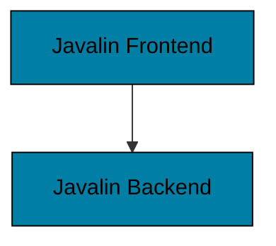
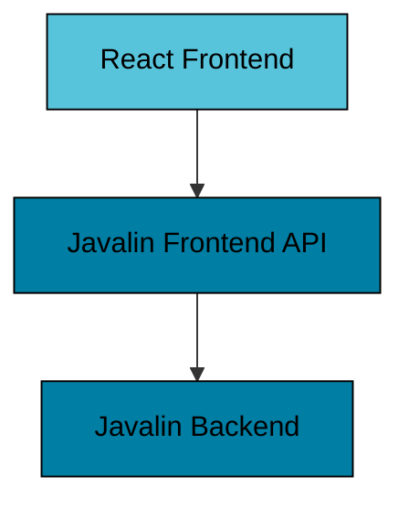

# Javalin Sandbox

This repository contain sandbox projects to showcase features of the [Javalin framework](https://javalin.io).

All examples are written in [Kotlin](https://kotlinlang.org) and built using [Gradle](https://gradle.org).

## Examples
Read details about the examples in their respective project roots.

## Architecture
[Javalin](https://javalin.io) is a lightweight framework for building applications for the
[JVM runtime](https://en.wikipedia.org/wiki/Java_virtual_machine).

The examples typically consists of a `Frontend` and a `Backend` application.

If the frontend is a JavaScript application then there is often also a `Frontend API` application.

## Use case
Most examples implement a "hello world" style logic that returns a greeting message when the user inputs a name.

* A user inputs the name "John" and clicks "Submit"
* The system generates a greeting "Hello John!" back to the user
